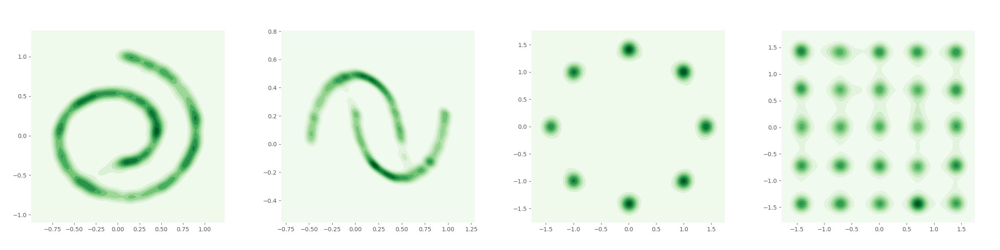
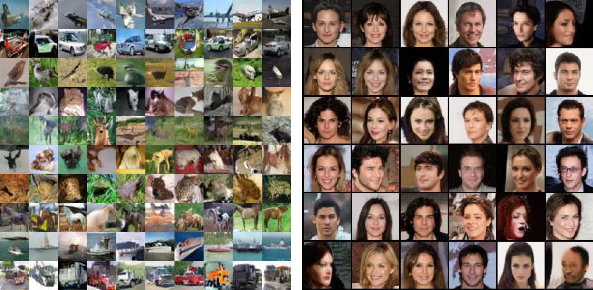

# Conditional Transport (CT) 

This is the pytorch implementation of experiments from the paper [Exploiting Chain Rule and Bayes' Theorem to Compare Probability Distributions](https://arxiv.org/abs/2012.14100), accepted in NeurIPS 2021.





## Quick starts 

To add CT loss in your existing code base, below we provide the key component of code for simplest usage:
```python
######################## Inputs ######################
# x: data B x C x W x H;  
# y: generated samples B x C x W x H;
# netN: navigator network  d -> 1
# netD: critic network C x W x H -> d
# rho: balance coefficient of forward-backward, default = 0.5

def ct_loss(x, y, netN, netD, rho):
    ######################## compute cost ######################
    f_x = netD(x) # feature of x: B x d
    f_y = netD(y) # feature of y: B x d
    cost = torch.norm(f_x[:,None] - f_y, dim=-1).pow(2) # pairwise cost: B x B
    
    ######################## compute transport map ######################
    mse_n = (f_x[:,None] - f_y).pow(2) # pairwise mse for navigator network: B x B x d
    d = netN(mse_n).squeeze().mul(-1) # navigator distance: B x B
    forward_map = torch.softmax(d, dim=1) # forward map is in y wise
    backward_map = torch.softmax(d, dim=0) # backward map is in x wise
    
    ######################## compute CT loss ######################
    # element-wise product of cost and transport map
    ct = rho * (cost * forward_map).sum(1).mean() + (1-rho) * (cost * backward_map).sum(0).mean() 
    return ct
```
For most existing code for GANs, the modification of the output dimension of discriminator network and adding a MLP as navigator are sufficient to make it ready to run. 

We also provide our implementation for experiment on toy data and image data for demo. 
Please refer to corresponding subfolder for more information.

### Requirements
pytorch >= 1.2.0
seaborn == 0.9.0
pandas
sklearn
Tensorboard (for visualization of toy data experiments, but optional)

Specifically, we run our experiments with pytorch 1.6.0, CUDA 10.2, cuDNN 7.0, and we also test our code with pytorch 1.2.0 and 1.7.0 to ensure reproducibility.


## Citation

If you find this code useful, please cite our paper in your work.

```
@article{zheng2020act,
  title={Exploiting Chain Rule and Bayes' Theorem to Compare Probability Distributions},
  author={Zheng, Huangjie and Zhou, Mingyuan},
  journal={arXiv preprint arXiv:2012.14100},
  year={2020}
}
```